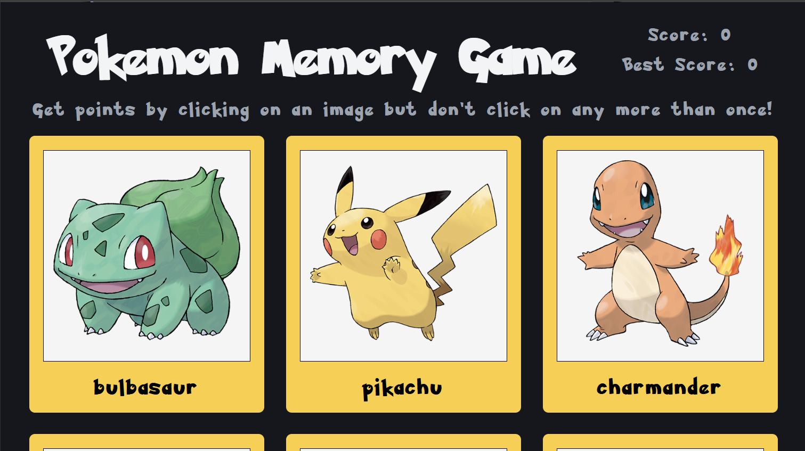
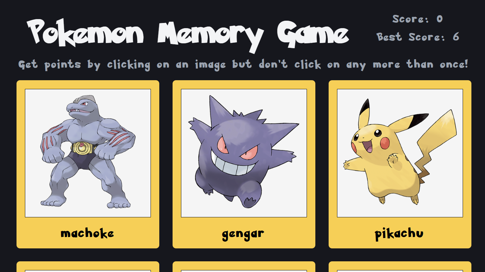

# Memory Game

- This is a simple game where the user clicks a few cards sequentially.
- If you click the same card twice, the game ends!

## Effects:
- When the game ends, a sound plays
- When you hover over a card, it displays an effect as if the card was picked.
- The game is playable by keyboard. The :hover animations also work for keyboard using :focus
- The site works for both dark and light mode

## Project: 
- React + Vite
- JavaScript
- CSS
- npm, eslint

## Loading page

## Score Updates

## Pokemon card hover effect

# React + Vite

This template provides a minimal setup to get React working in Vite with HMR and some ESLint rules.

Currently, two official plugins are available:

- [@vitejs/plugin-react](https://github.com/vitejs/vite-plugin-react/blob/main/packages/plugin-react) uses [Oxc](https://oxc.rs)
- [@vitejs/plugin-react-swc](https://github.com/vitejs/vite-plugin-react/blob/main/packages/plugin-react-swc) uses [SWC](https://swc.rs/)

## React Compiler

The React Compiler is not enabled on this template because of its impact on dev & build performances. To add it, see [this documentation](https://react.dev/learn/react-compiler/installation).

## Expanding the ESLint configuration

If you are developing a production application, we recommend using TypeScript with type-aware lint rules enabled. Check out the [TS template](https://github.com/vitejs/vite/tree/main/packages/create-vite/template-react-ts) for information on how to integrate TypeScript and [`typescript-eslint`](https://typescript-eslint.io) in your project.

